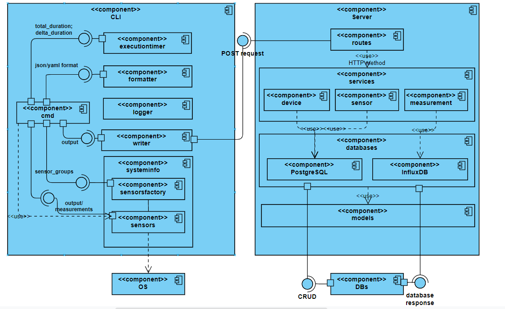
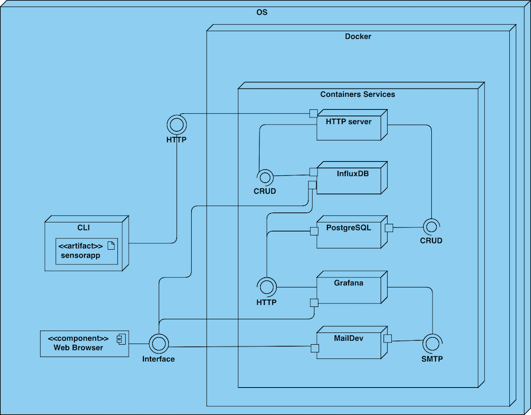

# Sensor App

Информационна система за мониторинг на компютри

---

## Използвани технологии

- Cobra
- Mux
- Mockery
- Ginkgo and Gomega
- PostgreSQL
- InfluxDB
- Docker
- Grafana

---

## Демо

- CLI
- CLI + server
- CLI + Grafana

---

## Компоненти

---

---

